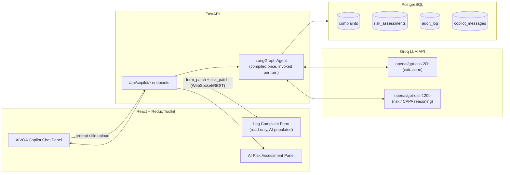

# AIVOA Round 1 — AI-Powered Customer Complaint Management System
## Architecture & Step-by-Step Build Plan

**Prepared for:** Ankit (DTU, CSE) — AIVOA AI Product Engineer Intern Assignment
**Goal of this document:** not just "what to build" but *why* every decision is made, so you can defend it in the interview and reuse the patterns in real work.

---

## 0. How to read this document

This is organized the way a senior engineer would actually approach an unfamiliar domain assignment:

1. **Research first** — understand the regulatory domain (pharma QMS) before writing a line of code, because the *form fields and AI reasoning only make sense once you know why they exist*.
2. **One critical technical finding** you need to know before you start (Groq model availability) — read this before you provision any API keys.
3. **System design** — data model, backend, AI agent graph, frontend — each with the reasoning, not just the diagram.
4. **A phased build plan** — 9 phases, each independently demoable, so you never have a "big bang" integration risk.
5. **Engineering practices & scalability** — the stuff that separates a hackathon toy from something a hiring panel calls "product thinking."
6. **Assumptions & open questions** — flagged explicitly rather than silently guessed.

---

## 1. Critical finding — read this before you touch the Groq API

I checked Groq's live model catalog and deprecation log before writing this plan (models move fast, and the assignment doc's mandated model has already been retired). Here's what's actually true **today**:

| Model named in assignment | Status | Replacement chain |
|---|---|---|
| `gemma2-9b-it` | **Deprecated 08 Oct 2025** | → `llama-3.1-8b-instant` → *also deprecated* 16 Aug 2026 → **`openai/gpt-oss-20b`** |
| `llama-3.3-70b-versatile` | **Deprecated 16 Aug 2026** | → **`openai/gpt-oss-120b`** (or `qwen/qwen3.6-27b`) |

**Both models the assignment tells you to use are gone.** This isn't a hypothetical — calling them today returns a hard API error. This is genuinely useful, because:

- It tells you the assignment document is a few months old (written before Groq's August 2026 deprecation wave) — normal in a fast-moving field, not a mistake on your part.
- It's a legitimate, citable engineering decision for your demo video: *"I checked Groq's current model catalog, found the specified models deprecated, and substituted the officially recommended replacements — here's the deprecation page."* That is exactly the kind of independent verification a product engineer is expected to do, and it's a strong thing to narrate on camera.
- The replacements are **strictly better for this use case**: `openai/gpt-oss-20b` and `openai/gpt-oss-120b` both support Groq's **Structured Outputs with `strict: true`** — constrained decoding that *guarantees* the JSON you get back matches your schema exactly, every time. `gemma2-9b-it` never had this. For a form-filling agent, this is the difference between "usually works" and "provably can't hallucinate an extra field or wrong type."

**Recommended mapping for this project:**

| Role | Model | Why |
|---|---|---|
| Extraction (Tool 1, 2, 3 — fast, structured, high volume) | `openai/gpt-oss-20b` | ~1000 tok/s, cheap, supports `strict: true` JSON schema |
| Reasoning (Risk Assessment / CAPA / root cause — needs judgment) | `openai/gpt-oss-120b` | Stronger reasoning, still supports `strict: true` |

Put both model IDs in `.env`, not hardcoded — see §5.5 for why.

---

## 2. Domain research — Quality Management Systems in pharma (API & FDF)

You don't need to become a QA professional, but you do need to know *why* the form has the fields it has, and *why* the AI needs to reason about severity and CAPA — otherwise you're just building a generic "extract JSON from text" app with a pharma skin, which is precisely what the assignment is testing you don't do.

### 2.1 What API and FDF mean

- **API (Active Pharmaceutical Ingredient):** the actual drug substance with biological activity — e.g., "Metformin Hydrochloride." Sold in bulk (drums, kg) to formulators.
- **FDF (Finished Dosage Form):** the API turned into something a patient actually takes — tablets, capsules, injections. Sold in retail units (strips, bottles).

This matters for your schema: an API complaint is measured in **kg / drums / batch purity**; an FDF complaint is measured in **tablets/capsules / strip defects / packaging**. Your "Affected Quantity" field and your completeness rules should branch on this (`dosage_form` enum), which is a nice, defensible design decision to point out in the interview.

### 2.2 Why "Customer Complaint" is a formal QMS module, not just a support ticket

In pharma, a complaint isn't customer service — it's a **regulatory signal that a released batch may be unsafe**. This is codified in law:

- **21 CFR §211.198** (US FDA, drug cGMP): manufacturers *must* have written complaint procedures, *must* investigate every quality-related complaint (with documented justification if they choose not to), and must keep records readily available for inspection.
- **21 CFR §211.180(e):** complaints must be *trended* — a single complaint might be noise, but the same batch/defect recurring is a systemic signal, and annual product review must include this analysis.
- **ICH Q10** treats complaint management as a core Pharmaceutical Quality System element, explicitly wired into **CAPA** (Corrective and Preventive Action) — a complaint that reveals a real defect must produce a corrective action, and a complaint that reveals a *risk* of defect must produce a preventive one.
- **ICH Q9** (Quality Risk Management) is where the "risk assessment" panel in your reference UI comes from. The classic tool is **FMEA**, scoring:

  **RPN (Risk Priority Number) = Severity × Occurrence × Detectability**

  Each scored 1–10. High RPN → route to formal CAPA investigation immediately. This is a great "bonus feature" hook (see §6).
- **Field Alert Reports (FARs):** if a distributed drug may not meet specification, the manufacturer must notify FDA within **3 calendar days**. This is exactly the kind of "regulatory deadline" flag your AI Copilot risk panel can compute and surface — and it's a genuinely impressive detail to include, because most Round-1 submissions won't know this exists.

### 2.3 The complaint lifecycle (this *is* your state machine)

```
Intake → Logging → Triage (Severity/Priority) → Investigation → Root Cause → CAPA → Closure → Trending
   ↑                                                                                            │
   └────────────────────────── feeds back into future triage/duplicate detection ───────────────┘
```

Map this directly onto your `status` enum and your LangGraph node sequence (§5.4) — the AI Copilot's job is to **automate Intake → Logging → Triage**, and the bonus features (Root Cause hints, CAPA recommendation) reach one step further into Investigation. You are not expected to build the whole lifecycle, but knowing where your system's boundary sits, and being able to say so, is exactly the "product thinking" the assignment says it's evaluating.

---

## 3. High-level architecture



**Component responsibilities, in one line each:**

- **Form (React):** a *dumb, read-only renderer* of Redux state. It never originates data — it only reflects what the agent decided. This directly encodes the assignment's hard rule ("you must not fill the form manually").
- **Copilot panel:** the only input surface. Sends text or files to the backend, streams back the assistant's reply and structured patches.
- **FastAPI:** thin HTTP layer — auth, validation, session management. It does **not** contain business logic; that lives in the LangGraph graph, so the graph is unit-testable independent of HTTP.
- **LangGraph agent:** the actual "brain" — see §5.4. This is where router/extraction/merge/risk logic lives as composable nodes.
- **Groq:** stateless inference calls. Two models, two jobs, as justified in §1.
- **PostgreSQL:** system of record. Every AI-driven change is also an audit-trail write — this is not optional in pharma (21 CFR Part 11 expects "who changed what, when, why").

---

## 4. Data model

Postgres over MySQL, for one concrete reason beyond "the assignment allows either": **JSONB**. You'll want to store the raw LLM extraction payload alongside the normalized columns (for debugging and re-processing without re-calling the LLM), and Postgres' native JSONB + your existing async SQLAlchemy/asyncpg experience from AGRIS carries over directly here.

### 4.1 `complaints`

| Column | Type | Notes |
|---|---|---|
| `id` | UUID PK | |
| `complaint_number` | text, unique | `CC-2026-00154` style, generated server-side |
| `status` | enum | `pending_triage`, `ready_to_commit`, `under_investigation`, `capa_in_progress`, `closed` |
| `dosage_form` | enum | `API`, `FDF` — drives which completeness rules apply |
| `complaint_source` | text | Email / Phone / Portal / Letter |
| `customer_name` | text | |
| `product_name` | text | |
| `product_strength_grade` | text | |
| `batch_lot_number` | text | indexed — needed for duplicate detection |
| `affected_quantity` | text | kept as text ("50 kg (2 HDPE Drums)") — see note below |
| `manufacturing_date` | date, nullable | |
| `expiry_date` | date, nullable | |
| `complaint_type` | text | |
| `complaint_date` | date | |
| `detailed_description` | text | |
| `raw_extraction_json` | JSONB | full LLM output for this record, for audit/debug |
| `created_at` / `updated_at` | timestamptz | |

> **Design note on `affected_quantity`:** the reference UI shows values like `"50 kg (2 HDPE Drums)"` — a composite, human-written string, not a clean number. Don't over-engineer this into `quantity_value + quantity_unit + container_type` columns for Round 1; store it as text and let the LLM own formatting. Trying to force structure the domain data doesn't cleanly have yet is a common overengineering trap — flag it as a "v2 improvement" in your README instead, which itself signals maturity.

### 4.2 `risk_assessments` (1:1 with `complaints`, but versioned — keep history)

| Column | Type | Notes |
|---|---|---|
| `id` | UUID PK | |
| `complaint_id` | FK | |
| `severity` | enum | `Minor`, `Major`, `Critical` |
| `occurrence_score` | int 1–10 | FMEA — how often does this defect type recur (bonus) |
| `detectability_score` | int 1–10 | FMEA — how easily is it caught before reaching customer (bonus) |
| `rpn` | int, generated | `severity_score * occurrence_score * detectability_score` |
| `recommended_action` | text | e.g. "Route to QA investigation and issue replacement" |
| `root_cause_hint` | text | AI's 5-Whys / 6M first guess — explicitly labeled as a *hint*, not a finding |
| `capa_recommendation` | text | bonus feature |
| `regulatory_flag` | bool | true if this looks FAR-reportable (spec failure) |
| `ai_reasoning_summary` | text | short "why" the model produced this — for QA reviewer trust |
| `model_used` | text | which Groq model produced it — traceability |
| `created_at` | timestamptz | |

### 4.3 `audit_log` — this is your 21 CFR Part 11 story

| Column | Type | Notes |
|---|---|---|
| `id` | UUID PK | |
| `complaint_id` | FK | |
| `field_name` | text | |
| `old_value` | text, nullable | |
| `new_value` | text | |
| `changed_by` | enum | `AI_COPILOT` (always, in Round 1 — no manual edits) |
| `source_message` | text | the exact NL prompt that caused this change |
| `created_at` | timestamptz | |

Every field the merge node changes gets one row here. This is *also* exactly what powers the blue-highlight "diff" effect you see in the reference screenshot (Batch/Lot Number and Affected Quantity highlighted after the correction) — the frontend just asks "what changed in this turn?" and highlights those field IDs.

### 4.4 `copilot_messages`

Standard chat history table (`session_id`, `role`, `content`, `created_at`) so a page refresh doesn't lose context — needed because your agent is explicitly multi-turn (log → then correct).

---

## 5. Backend design (FastAPI + LangGraph)

### 5.1 Project structure

```
backend/
├── app/
│   ├── main.py                  # FastAPI app, CORS, router mounts
│   ├── api/
│   │   └── copilot.py           # POST /copilot/message, /copilot/upload
│   ├── db/
│   │   ├── models.py            # SQLAlchemy models
│   │   └── session.py           # async engine/session
│   ├── schemas/
│   │   └── complaint.py         # Pydantic — SINGLE SOURCE OF TRUTH (see 5.2)
│   ├── agent/
│   │   ├── state.py             # LangGraph state TypedDict
│   │   ├── graph.py             # graph wiring (compiled once at startup)
│   │   ├── nodes/
│   │   │   ├── router.py
│   │   │   ├── extraction.py
│   │   │   ├── merge.py
│   │   │   ├── completeness.py
│   │   │   ├── duplicate.py
│   │   │   ├── risk_capa.py
│   │   │   └── compose_response.py
│   │   └── prompts/              # .txt/.jinja system prompts, kept out of code
│   ├── llm/
│   │   ├── base.py               # provider-agnostic interface
│   │   ├── groq_provider.py      # primary (mandatory per assignment)
│   │   └── openai_provider.py    # optional fallback — see 5.5
│   └── parsers/
│       ├── pdf_parser.py
│       └── email_parser.py
├── requirements.txt
└── .env.example
```

### 5.2 Pydantic schema as the single source of truth

This is the single highest-leverage design decision in the whole project. Define the complaint fields **once**, as a Pydantic model, and derive three things from it:

1. The Groq `strict` JSON schema (via `.model_json_schema()`)
2. The SQLAlchemy table columns
3. The TypeScript/Redux shape the frontend expects (export as JSON schema → generate types, or just hand-mirror it once)

```python
# app/schemas/complaint.py
from pydantic import BaseModel, Field
from typing import Literal, Optional

class ComplaintFields(BaseModel):
    complaint_source: Optional[str] = Field(None, description="Email, Phone, Portal, Letter")
    customer_name: Optional[str] = None
    product_name: Optional[str] = None
    product_strength_grade: Optional[str] = None
    batch_lot_number: Optional[str] = None
    affected_quantity: Optional[str] = None
    manufacturing_date: Optional[str] = None   # ISO string; LLM rarely gets bare `date` right
    expiry_date: Optional[str] = None
    dosage_form: Optional[Literal["API", "FDF"]] = None
    complaint_type: Optional[str] = None
    complaint_date: Optional[str] = None
    detailed_description: Optional[str] = None

class RiskAssessment(BaseModel):
    severity: Literal["Minor", "Major", "Critical"]
    recommended_action: str
    root_cause_hint: Optional[str] = None
    regulatory_flag: bool = False
    ai_reasoning_summary: str
```

Why this matters: without it, you will drift — the form will silently expect a field the LLM schema doesn't produce, or vice versa, and you'll spend your limited assignment time debugging a `KeyError` instead of demonstrating AI reasoning. One schema, three consumers, zero drift. This is the same discipline as your `relevance_base.py` pattern in AGRIS — a single shared contract instead of three hand-synced copies.

### 5.3 API surface

| Endpoint | Method | Purpose |
|---|---|---|
| `/api/copilot/message` | POST | Send a text prompt (log or edit). Returns `{assistant_reply, form_patch, risk_patch, changed_fields}` |
| `/api/copilot/upload` | POST (multipart) | PDF/email upload → same response shape as above |
| `/api/complaints/{id}` | GET | Fetch current form + risk state (for reload/refresh) |
| `/api/complaints/{id}/audit` | GET | Audit trail for a complaint (nice bonus screen) |
| `/api/complaints/{id}/commit` | POST | Persist final "Save Complaint" — separate from the AI patches, which can stay provisional until committed |

Two endpoints collapse into one graph invocation each — this is intentional. **The router node, not the API layer, decides "new vs edit vs document."** Keeping that decision inside the agent (not as separate REST routes) is what makes Tool 1 and Tool 2 actually be *one* agent with reasoning, rather than two disconnected hardcoded features — which is the difference the demo video is explicitly testing for ("understand what the code does... adapt it to match the workflow").

### 5.4 The LangGraph agent — node by node

**Analogy first, since it helps to anchor this before the code:** think of the graph like a hospital ER intake process. A triage nurse (**router**) first decides *is this a new patient or a follow-up on an existing case?* Then a resident (**extraction**) writes down the vitals. A senior resident (**merge**) checks the new vitals against the existing chart and only updates what actually changed, leaving the rest of the chart alone. An admin (**completeness**) checks if the required intake paperwork is done. Someone checks the records (**duplicate**) for "haven't we seen this exact issue before?" And finally a specialist (**risk/CAPA**) makes the actual clinical judgment call. Each of these is a distinct skill, done by a distinct "person" (node) — that's why this isn't one giant prompt.

```python
# app/agent/state.py
from typing import TypedDict, Literal, Optional

class CopilotState(TypedDict):
    session_id: str
    complaint_id: Optional[str]
    user_input: str
    input_type: Literal["text", "document"]
    intent: Optional[Literal["new_complaint", "edit_complaint", "chit_chat"]]
    current_form: dict          # form state BEFORE this turn
    extracted_fields: dict      # raw LLM output THIS turn
    merged_form: dict           # reconciled result
    changed_fields: list[str]   # for FE highlighting + audit log
    completeness_pct: float
    missing_fields: list[str]
    duplicate_matches: list[dict]
    risk_assessment: dict
    assistant_reply: str
```

**Graph wiring:**

```
START
  → router_node
      ├─(input_type == "document")→ document_parser_node → extraction_node
      └─(input_type == "text")────────────────────────────→ extraction_node
  → merge_node
  → completeness_node
  → duplicate_node
  → risk_capa_node
  → compose_response_node
  → END
```

| Node | Model used | Job | Key design decision |
|---|---|---|---|
| `router_node` | none (or cheap classification call) | Decide `new_complaint` vs `edit_complaint` | Cheapest heuristic that's still robust: if `current_form` is empty for this session → `new_complaint`. If populated, run a lightweight classification prompt on `openai/gpt-oss-20b` — but **the presence of an existing form is 90% of the signal already**, so don't over-build this. |
| `document_parser_node` | none | PDF/email → plain text | Use `pdfplumber` for PDFs, Python's `email` module for `.eml`. Assignment explicitly says production-grade OCR isn't required — plain text extraction is enough. |
| `extraction_node` | `gpt-oss-20b`, `strict: true` | NL/document text → `ComplaintFields` JSON | This is Tool 1 and the extraction half of Tool 3 — literally the same node, different upstream input. **This reuse is the whole point of the graph architecture.** |
| `merge_node` | none (pure logic) | Reconcile `extracted_fields` into `current_form` | **This is Tool 2's actual mechanism.** See callout below — it's not an LLM call. |
| `completeness_node` | none (pure logic) | % of 21 CFR §211.198-relevant fields filled, branched by `dosage_form` | Bonus feature #1 — deterministic, cheap, and directly regulation-grounded (a genuinely strong talking point). |
| `duplicate_node` | none (SQL query) | Match on `product_name` + `batch_lot_number` prefix against existing complaints | Bonus feature #2 — a plain Postgres `WHERE` query is enough for Round 1; don't reach for vector embeddings unless you have spare time (see §6). |
| `risk_capa_node` | `gpt-oss-120b`, `strict: true` | Severity, RPN, root cause hint, CAPA suggestion, regulatory flag | The "reasoning" half — deliberately the bigger model, because this is judgment, not extraction. |
| `compose_response_node` | `gpt-oss-20b` (or template) | Turn structured results into the chat bubble text ("I've applied the correction...") | Can be a Jinja template instead of an LLM call for Round 1 — cheaper, more predictable, and the reference screenshot's assistant replies are short and formulaic anyway. |

**Why `merge_node` matters more than it looks — this is the actual "Edit Complaint Tool":**

The demo transcript says: *"sorry, the batch number is BMX24602 and the affected quantity is 48 capsules... update both... while preserving all other complaint information."*

The naive (wrong) approach is to re-run full extraction on the correction message alone — you'd get a `ComplaintFields` object where everything except batch/quantity is `None`, and if you blindly overwrite the form with that, you've just wiped out the product name, dates, etc. That's a real bug, not a hypothetical — watch for it.

The correct pattern:

```python
def merge_node(state: CopilotState) -> CopilotState:
    merged = dict(state["current_form"])  # start from what exists
    changed = []
    for field, value in state["extracted_fields"].items():
        if value is not None and value != merged.get(field):
            changed.append(field)
            merged[field] = value
    state["merged_form"] = merged
    state["changed_fields"] = changed
    return state
```

Only fields the LLM actually populated (non-null) overwrite the form; everything else is preserved by construction. This also directly produces `changed_fields`, which both the audit log and the frontend's blue-highlight effect need — one piece of logic, two consumers, no duplication.

### 5.5 LLM provider layer — provider-agnostic, Groq primary

You already did this exact pattern in AGRIS (`relevance_factory.py` + per-provider callers). Reuse it:

```python
# app/llm/base.py
class LLMProvider(Protocol):
    def structured_completion(self, system: str, user: str, schema: type[BaseModel], model: str) -> BaseModel: ...
```

- `groq_provider.py` — **mandatory, primary**, uses `strict: true` json_schema mode.
- `openai_provider.py` — **optional fallback only**, wired behind an env flag (`LLM_PROVIDER=groq`). Your OpenAI key is genuinely useful here as a *resilience* story ("if Groq rate-limits during the live demo, I fail over"), which is a legitimate senior-engineer instinct — but the assignment's graded path must run on Groq by default. Don't let the fallback become the primary path by accident; that would violate the mandatory stack requirement.

This also gives you a clean answer if an interviewer asks "what if Groq goes down in production" — you already thought about it, and you have working code, not just a claim.

### 5.6 Guardrails against LLM mistakes (don't skip this)

- Always call with `strict: true` where the model supports it (both `gpt-oss-20b`/`120b` do) — this removes an entire category of "malformed JSON" bugs by construction.
- `merge_node` only ever accepts non-null fields — a hallucinated `null` can't destroy existing data.
- Log `raw_extraction_json` on every complaint row — if the AI gets something wrong, you can show *exactly* what the model returned, which is invaluable both for debugging and for your demo video's "here's how I'd trust this in production" story.
- Cap `detailed_description` length and strip it before logging to avoid prompt-injection-via-PDF turning into runaway completions — worth one sentence in your README even if you don't fully harden it.

---

## 6. Bonus AI features — recommended priority order

Don't build all of them evenly; the assignment says "additional AI features are highly appreciated," which means *depth on two or three* beats *shallow coverage of six*. Priority, based on effort-vs-signal:

1. **Complaint Completeness Checker** — cheapest to build (pure logic against your schema + `dosage_form` branching), and it's the most *regulation-grounded* feature you can point to directly by section number (21 CFR §211.198). Build this first.
2. **AI Risk Classification (RPN)** — you're already calling `gpt-oss-120b` for severity; extending to full FMEA (Severity × Occurrence × Detectability) is a small prompt change with a large "I understood the domain" payoff.
3. **CAPA Recommendation + Root Cause hint (5-Whys / 6M)** — same node, same call, just ask for two more structured fields. High signal, near-zero marginal engineering cost once `risk_capa_node` exists.
4. **Duplicate Complaint Detection** — a plain SQL `WHERE product_name = X AND batch_lot_number LIKE Y%` query is legitimate and sufficient for Round 1. Explicitly *don't* build a vector-embedding similarity search unless everything else is done — it's the highest-effort, lowest-marginal-signal bonus on this list for a one-week assignment, and over-building it at the expense of the mandatory tools would be the wrong call.
5. **Complaint Summary** — genuinely the easiest: one more field on `compose_response_node`'s output. Nice to have, not worth much engineering time.

---

## 7. Frontend design (React + Redux Toolkit)

### 7.1 State slices

```
store/
├── complaintFormSlice.ts   # the 12 form fields — reducers only accept `applyPatch(fields, changedKeys)`
├── riskAssessmentSlice.ts  # severity/RPN/CAPA/root-cause
├── chatSlice.ts            # message history, streaming status
└── sessionSlice.ts         # session_id, complaint_id, status badge
```

The critical constraint from the demo video — **"you must not fill the left form manually"** — should be enforced *architecturally*, not just by convention:

```ts
// complaintFormSlice.ts
const complaintFormSlice = createSlice({
  name: "complaintForm",
  initialState,
  reducers: {
    applyPatch(state, action: PayloadAction<{ fields: Partial<ComplaintFields>; changedKeys: string[] }>) {
      Object.assign(state.fields, action.payload.fields);
      state.lastChangedKeys = action.payload.changedKeys;
    },
    // NOTE: deliberately no `setField` reducer exists.
    // The <input> components are read-only by construction —
    // there is no dispatch path from a keystroke to form state.
  },
});
```

There being *no reducer that a text input could call* is a stronger guarantee than a `disabled` HTML attribute alone — it means even a future contributor can't accidentally wire up manual editing without deliberately adding a new reducer, which is a nice thing to point out if asked about your Redux design.

### 7.2 Component tree & the highlight effect

```
<App>
 ├── <ComplaintFormPanel>          # reads complaintFormSlice, purely presentational
 │    └── <FormField highlighted={changedKeys.includes(fieldName)} />
 ├── <RiskAssessmentPanel>         # reads riskAssessmentSlice
 └── <CopilotPanel>
      ├── <MessageList>
      ├── <FileDropzone>           # PDF/email upload → /copilot/upload
      └── <MessageInput>           # text prompt → /copilot/message
```

`changedKeys` (from the API response, straight out of `merge_node`) drives a CSS class for ~2 seconds — this reproduces the blue-highlighted "Batch/Lot Number" box you can see in the reference screenshot after the correction, with no extra backend work: it's the same `changed_fields` list that feeds the audit log.

### 7.3 Data flow for one turn

```
User types correction → dispatch(sendMessage(text)) [thunk]
  → POST /api/copilot/message
  → (backend runs the graph, returns { assistant_reply, form_patch, changed_fields, risk_patch })
  → dispatch(complaintFormSlice.applyPatch(...))
  → dispatch(riskAssessmentSlice.applyPatch(...))
  → dispatch(chatSlice.addMessage(assistant_reply))
  → React re-renders — changed fields flash, chat shows reply
```

One network round trip, three coordinated state updates. No optimistic UI needed — the assignment doesn't require sub-second latency, and Groq's inference speed (hundreds of tokens/sec) makes a plain "loading" spinner on the chat bubble perfectly fine for Round 1.

### 7.4 Styling

Google **Inter** is mandated — load via `@fontsource/inter` (self-hosted, avoids a runtime dependency on Google Fonts CDN, which also happens to be a more production-appropriate choice than a `<link>` tag). Keep the visual design close to the reference screenshot (light theme, card-based sections, colored status pill) — the assignment explicitly says exact pixel match isn't required, so spend your time on the *functionality*, not recreating the mockup precisely.

---

## 8. Step-by-step build plan (9 phases)

Each phase should leave you with something you can actually run and show — never a half-wired system. This also means if you run out of time, you stop at a *working* checkpoint instead of a broken one.

| Phase | Deliverable at end of phase | Est. effort |
|---|---|---|
| **0 — Setup** | Repo scaffold (frontend + backend), `.env.example`, Postgres running locally (Docker Compose is the clean choice — one `docker-compose.yml` with `postgres` + your FastAPI app), Groq API key tested with a `curl` call to `gpt-oss-20b` | 0.5 day |
| **1 — Data layer** | SQLAlchemy models from §4 migrated (use Alembic — trivial extra effort, real credibility signal), seed script with 2–3 fake complaints for manual testing | 0.5 day |
| **2 — Agent skeleton (mocked)** | LangGraph graph wired end-to-end with **stubbed** node functions returning hardcoded data — proves the *graph shape* is right before you spend a single Groq API call debugging it | 0.5 day |
| **3 — Real extraction** | `extraction_node` calling `gpt-oss-20b` with `strict: true` against `ComplaintFields` schema; test with 5–10 hand-written complaint prompts, log where it under/over-extracts | 1 day |
| **4 — Merge + completeness + router** | Tool 2 (edit) working end-to-end via CLI/Postman before any frontend exists — this isolates "is my agent logic right" from "is my React code right" | 0.5–1 day |
| **5 — Frontend skeleton** | Redux store, form panel (static, AI-only reducers), chat panel UI — wired to a **mocked** backend response first | 1 day |
| **6 — Frontend ↔ backend integration** | Real POST calls, `applyPatch` flow, field-highlight animation, status badge (`Pending Triage` → `Ready to Commit` once `completeness_pct` crosses your threshold, matching the reference screenshots exactly) | 1 day |
| **7 — Document extraction (Tool 3)** | PDF/email parser + upload UI; create 2–3 realistic sample complaint PDFs yourself (see §9) | 0.5–1 day |
| **8 — Bonus features + risk/CAPA node** | `gpt-oss-120b` risk_capa_node live, completeness checker, duplicate detection | 1 day |
| **9 — Polish + demo prep** | README, `.env.example`, seed script, both demo videos recorded (see §10), final code cleanup pass | 1 day |

That's roughly 7–9 focused days — plan for the assignment to take about a week of real (not just calendar) time if you want the depth this document describes, not a rushed weekend.

---

## 9. Sample realistic test data

Build 3 fixtures before you build any features — testing against real-shaped data from day one avoids the classic trap of an agent that only works on the one example you happened to type while coding it.

1. **NL prompt (Tool 1):** *"Apollo Pharmacy reported discolored capsules in Amoxicillin Capsules 500mg, batch AMX24601, manufactured 12 March 2026, expiring Feb 2028. Customer received via email on 14 September 2026."*
2. **Correction prompt (Tool 2):** *"Sorry, the batch number is AMX24602 and affected quantity is 48 capsules."*
3. **PDF (Tool 3):** write a one-page fake complaint letter — letterhead ("Zenith Life Sciences"), a complaint reference number, product = an API this time (e.g., "Metformin Hydrochloride API, IP/BP grade"), batch number, a description of foreign-matter contamination. Export to PDF from Google Docs/Word — no special tooling needed, and the assignment explicitly says production-grade OCR isn't required.

Keep these three fixtures in `backend/fixtures/` — they double as your demo video script *and* as informal regression tests ("does Tool 2 still preserve the product name after I refactor the merge node?").

---

## 10. The two demo videos — my read on the ambiguous instruction

The assignment says "5–10 minutes demo video explaining... (2 video submission)" and then lists two distinct kinds of content in one bullet list. My read: **it wants two separate videos**, split along that same seam:

- **Video 1 — Product demo (5–10 min):** screen recording of the working app. Run all three tools live (Tool 1 → Tool 2 correction → Tool 3 document upload), show the risk panel populate, show the bonus features. This is basically "prove it works," recorded once you finish Phase 8.
- **Video 2 — Code walkthrough (5–10 min):** narrated tour of the *architecture*, following the exact path data takes: frontend `MessageInput` → `/api/copilot/message` → FastAPI route → `graph.invoke()` → walk through router → extraction → merge → risk nodes → back to `applyPatch` in Redux → form re-render. This is where you narrate the Groq model-deprecation finding from §1 — it's a strong, specific, verifiable detail that most other candidates almost certainly won't have.

This is a reasonable interpretation but **worth a quick confirmation from AIVOA or a re-read of the submission form** before you record — it's cheap to double check and expensive to re-record.

---

## 11. Engineering best practices checklist

- [ ] **One schema, not three** — Pydantic model in §5.2 is the only place field names are defined.
- [ ] **`strict: true`** on every Groq structured-output call where the model supports it.
- [ ] **Async all the way** — FastAPI + SQLAlchemy async + Groq's async client; don't block the event loop on a sync HTTP call.
- [ ] **Config via `.env`**, never hardcoded model names or API keys — this is also what makes the §1 deprecation issue a five-second fix instead of a code change.
- [ ] **Audit log write is part of the same transaction as the complaint update** — if one fails, both roll back. Pharma data integrity, not just good practice.
- [ ] **Unit-test LangGraph nodes independently** — `merge_node` especially, since it's pure Python and the easiest place to introduce the exact "correction wipes other fields" bug described in §5.4. A single pytest with 3–4 cases catches this permanently.
- [ ] **Structured logging** — log `session_id`, `intent`, `model_used`, and latency per node call. You don't need Prometheus for Round 1, but a clean `logger.info(...)` per node is what makes the code walkthrough video easy to narrate ("here you can see the router decided `edit_complaint`...").
- [ ] **README that a stranger can run from** — `docker-compose up`, `.env.example`, seed script, one command to start frontend. This is graded implicitly the moment someone on the hiring panel tries to run your repo.
- [ ] **No secrets committed** — `.gitignore` your `.env` from commit #1, not commit #20.

---

## 12. Scalability — how this design survives beyond a Round-1 demo

You won't build all of this, but being able to *talk through it* in an interview is exactly what "scalable design" means at intern level — showing you know where the seams are.

- **Stateless API layer:** FastAPI holds no in-memory session state (the graph reads/writes Postgres each turn), so you can run N replicas behind a load balancer with zero sticky-session requirements.
- **Graph compiled once at startup**, reused per request — LangGraph's `StateGraph.compile()` is not free; don't rebuild it per request.
- **Connection pooling:** async SQLAlchemy engine with a bounded pool — same pattern as AGRIS's asyncpg setup, so this isn't new territory for you.
- **New product lines beyond API/FDF:** because `dosage_form` is an enum driving *completeness rules*, adding a third category (e.g., biologics) is a schema + rules change, not a rewrite.
- **New AI tools without breaking existing ones:** the graph is composable — adding, say, a "translate complaint to English first" node is one new node + one new edge, not a rewrite of `extraction_node`. This is the entire reason the router/extraction/merge split exists instead of one mega-prompt.
- **New document types:** `parsers/` is a strategy pattern already — adding `.docx` or scanned-image OCR later is a new file implementing the same "bytes → text" interface, not a change to the agent at all.
- **Multi-tenant readiness:** every table already has room for a `tenant_id`/`facility_id` column if AIVOA's real product needs to separate customers — worth mentioning, not worth building now.
- **LLM provider resilience:** the provider-agnostic layer from §5.5 means a future move to, say, a self-hosted model for data-residency reasons is a new `provider.py` file, not an application rewrite.

---

## 13. Assumptions & open questions

Flagging these explicitly rather than guessing silently:

1. **Database:** assumed PostgreSQL over MySQL (continuity with your AGRIS stack + JSONB support). If you'd rather use MySQL for some reason, the only real change is the `raw_extraction_json` column type (`JSON` instead of `JSONB`) — everything else in this plan is DB-agnostic.
2. **Video split:** my read in §10 is an interpretation, not a confirmed fact — worth a quick sanity check against the submission form before recording.
3. **Hosting for the demo:** this plan assumes you run everything locally (`docker-compose up`) for the recording. If you want it deployed somewhere reachable (Render/Railway free tiers work fine for a Postgres + FastAPI + static React stack), that's an easy Phase 9 add-on — say the word and I'll fold in a deployment section.
4. **Auth:** intentionally out of scope for Round 1 — the assignment doesn't mention multi-user login, and adding it would burn time better spent on the three mandatory AI tools.

---

## 14. What I'd build first if I were you, today

If you want a concrete "start typing now" answer: **Phase 0 → Phase 2 (mocked graph)**. Get the LangGraph shape right with fake data before spending a single real Groq call — it's the cheapest place to catch a wrong architecture, and it means Phase 3 onward is "swap in real calls," not "figure out the design under pressure."

Once you've got Phase 2 running, tell me and I'll help you write the actual `extraction_node` prompt + schema for Phase 3 — that's the highest-leverage single file in the whole project to get right.
