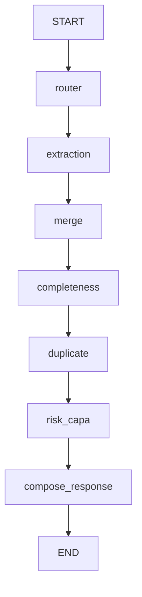

# AIVOA

**AI-Powered Customer Complaint Management System** for pharmaceutical quality management (QMS).

AIVOA automates complaint intake, triage, and risk assessment for pharmaceutical companies, supporting both API (Active Pharmaceutical Ingredient) and FDF (Finished Dosage Form) product lines. An AI Copilot processes natural-language complaints and document uploads, populates structured complaint forms, and generates risk assessments — all grounded in regulatory frameworks (21 CFR §211.198, ICH Q9/Q10).

---

## Architecture

```
React (Vite)
  ↓  HTTP API
FastAPI
  ↓
LangGraph Agent        ← future chunk
  ↓
Groq LLM              ← future chunk
  (gpt-oss-20b / gpt-oss-120b)
  ↓
PostgreSQL
```

### Component Status

| Component            | Status       | Notes                                          |
| -------------------- | ------------ | ---------------------------------------------- |
| React frontend       | ✅ Scaffold  | Vite + React 19, placeholder page              |
| FastAPI backend       | ✅ Running   | Health endpoint, CORS configured               |
| PostgreSQL           | ✅ Docker    | docker-compose with healthcheck                |
| SQLAlchemy models    | ✅ Complete  | 4 tables, enums, indexes, relationships        |
| Alembic migrations   | ✅ Complete  | Async-aware, initial migration generated       |
| Pydantic schemas     | ✅ Complete  | Canonical contracts for API, LLM, frontend     |
| LangGraph agent      | ✅ Scaffold  | Mocked deterministic workflow structure        |
| Groq LLM extraction  | ✅ Complete  | Provider abstraction + structured output       |
| Groq LLM reasoning   | 🔲 Planned   | Chunk 6+                                       |
| Redux Toolkit        | 🔲 Planned   | Chunk 6                                        |
| Complaint form UI    | 🔲 Planned   | Chunk 6–7                                      |
| Risk/CAPA assessment | 🔲 Planned   | Chunk 8                                        |
| PDF/email parsing    | 🔲 Planned   | Chunk 7                                        |

### Current Status

```
Chunk 5 — Real LLM Extraction
```

---

## Requirements

| Tool       | Minimum Version |
| ---------- | --------------- |
| Python     | 3.11+           |
| Node.js    | 18+             |
| npm        | 9+              |
| Docker     | 24+             |
| Git        | 2.40+           |

---

## Setup

### 1. Clone the project

```bash
git clone <repo-url>
cd AIVOA
```

### 2. Environment configuration

```bash
cp .env.example .env
# Edit .env with your actual values (Groq API key, etc.)
```

> ⚠️ Never commit `.env` — it is gitignored. Only `.env.example` is tracked.

### 3. Start PostgreSQL

```bash
docker-compose up -d
```

Verify it's healthy:

```bash
docker-compose ps
```

### 3b. Run database migrations

```bash
cd backend
alembic upgrade head
```

This creates the `complaints`, `risk_assessments`, `audit_log`, and `copilot_messages` tables.

### 3c. Seed sample data (optional)

```bash
cd backend
python -m app.db.seed
```

Inserts two sample complaints (one FDF, one API) for manual testing.

### 4. Backend setup

```bash
cd backend
python -m venv .venv

# Windows
.venv\Scripts\activate

# macOS/Linux
source .venv/bin/activate

pip install -r requirements.txt
```

### 5. Run FastAPI

```bash
cd backend
uvicorn app.main:app --reload --port 8000
```

Verify: open [http://localhost:8000/health](http://localhost:8000/health) — should return `{"status": "ok"}`

API docs: [http://localhost:8000/docs](http://localhost:8000/docs)

### 6. Run backend tests

```bash
cd backend
pytest -v
```

### 7. Frontend setup

```bash
cd frontend
npm install
npm run dev
```

Opens at [http://localhost:5173](http://localhost:5173)

---

## Database

PostgreSQL is the **system of record** for all complaint data. Every AI-driven change is persisted alongside an audit trail, satisfying pharma regulatory requirements (21 CFR Part 11).

### Core Tables

| Table              | Purpose                                              |
| ------------------ | ---------------------------------------------------- |
| `complaints`       | Central complaint record (AI-populated fields)       |
| `risk_assessments` | AI-generated risk/CAPA assessments (versioned)       |
| `audit_log`        | Immutable change history (who changed what, when)    |
| `copilot_messages` | Multi-turn chat history for page refresh persistence |

### Key Design Decisions

- **UUID primary keys**: globally unique, safe for future multi-tenant/distributed scenarios, no sequential-ID enumeration risk.
- **complaint_number**: separate human-readable business identifier (`CC-2026-00154`). Decoupled from the PK so it can follow business formatting rules.
- **JSONB for raw_extraction_json**: stores the exact LLM output for every complaint. Enables debugging, re-processing, and audit without re-calling the LLM. PostgreSQL-native JSONB supports indexing if needed later.
- **Versioned risk assessments**: stored as separate rows (not 1:1 overwrite) so assessment history is preserved as more complaint info is provided.
- **Audit log**: every field change by the AI produces one row — this powers both compliance reporting and the frontend's field-highlight "diff" effect.

### Indexes

| Index                             | Reason                                 |
| --------------------------------- | -------------------------------------- |
| `complaint_number` (unique)       | Business identifier lookups            |
| `batch_lot_number`                | Duplicate detection queries            |
| `session_id` (copilot_messages)   | Efficient conversation retrieval       |
| `(complaint_id, created_at)` (audit_log) | Chronological audit trail queries |

### Migrations

Alembic manages schema migrations with async support (asyncpg). The initial migration creates all four tables, PostgreSQL enum types, indexes, and foreign key constraints.

```bash
cd backend
alembic upgrade head     # apply migrations
alembic downgrade -1     # rollback last migration
alembic history          # view migration history
```

---

## Application Contracts

The backend maintains a strict separation between two data layers:

| Layer | Location | Role |
|---|---|---|
| **SQLAlchemy models** | `app/db/models.py` | Database persistence — table definitions, constraints, relationships |
| **Pydantic schemas** | `app/schemas/complaint.py` | Validated application/AI contracts — API, LLM extraction, frontend |

These two layers do NOT inherit from each other. SQLAlchemy owns "how data is stored"; Pydantic owns "how data is validated and exchanged."

**`ComplaintFields`** is the canonical complaint shape (§5.2 of the architecture spec). It is used by:
- The extraction LLM (via `.model_json_schema()` for Groq's `strict: true` mode)
- The merge node (partial patch: only non-None fields overwrite the form)
- FastAPI responses (`form_patch` in the copilot response)
- The frontend (drives the read-only complaint form)

All complaint fields are **Optional** because AI extraction may only find some fields, users provide information incrementally, and the merge node uses `None` to mean "no change."

---

## LangGraph Workflow (Chunk 4)

LangGraph is the workflow/orchestration layer. The LangGraph state acts as temporary working memory for one workflow execution. (PostgreSQL remains the persistent system of record). Each node in the graph has a single responsibility.

Currently, all nodes are mocked and deterministic. Real LLM/database integrations will be added in later chunks.



---

## Real LLM Extraction (Chunk 5)

The extraction node now calls Groq's API for structured complaint field extraction.

```
User Input
    ↓
Extraction Node
    ↓
LLM Provider (GroqLLMProvider)
    ↓
Groq API (json_schema, strict: true)
    ↓
Structured ComplaintFields
    ↓
Pydantic Validation
    ↓
LangGraph State (extracted_fields)
    ↓
Merge Node
```

**Key design decisions:**

- **Provider abstraction**: `LLMProvider` protocol in `app/llm/base.py` keeps the graph independent from any specific LLM vendor. `GroqLLMProvider` is the concrete implementation.
- **Structured output**: Uses Groq's `json_schema` response format with `strict: true` — constrained decoding guarantees the JSON matches `ComplaintFields` exactly.
- **Null semantics**: Missing fields are `null` / `None`, never `"Unknown"` or `"N/A"`. The merge node ignores null values by design.
- **Input size limit**: 10,000 characters maximum to prevent runaway token usage.
- **Dependency injection**: `build_graph(llm_provider=..., extraction_model=...)` — tests inject a `FakeLLMProvider`, production uses `GroqLLMProvider`.
- **Extraction model**: Configurable via `EXTRACTION_MODEL` env var (default: `openai/gpt-oss-20b`).
- **Tests never call Groq**: All 12 extraction tests use deterministic fake providers.
- **Risk/CAPA and other reasoning**: Still mocked. Only extraction uses the LLM in this chunk.

---

## Async Architecture

The backend is built async-first (`async def` endpoints, async-compatible structure). This is deliberate because the production workflow involves:

1. Multiple sequential LLM API calls per complaint (extraction → merge → risk assessment)
2. Database reads/writes between agent nodes
3. Concurrent users submitting complaints simultaneously

Blocking the event loop on any of these would starve other requests. The async foundation ensures that SQLAlchemy (asyncpg), Groq's async client, and FastAPI all share the same event loop without blocking.

---

## Project Structure

```
AIVOA/
├── backend/
│   ├── app/
│   │   ├── __init__.py
│   │   ├── main.py              # FastAPI application
│   │   ├── core/
│   │   │   └── config.py        # pydantic-settings configuration
│   │   ├── db/
│   │   │   ├── models.py        # SQLAlchemy ORM models (4 tables)
│   │   │   ├── session.py       # Async engine & session factory
│   │   │   └── seed.py          # Sample data for testing
│   │   ├── schemas/
│   │   │   ├── __init__.py      # Public exports
│   │   │   └── complaint.py     # Canonical Pydantic data contracts
│   │   ├── graph/
│   │   │   ├── state.py         # LangGraph state TypedDict
│   │   │   ├── graph.py         # Workflow wiring (provider-injectable)
│   │   │   ├── prompts/
│   │   │   │   └── extraction.py # Extraction system prompt
│   │   │   └── nodes/           # Workflow nodes
│   │   │       ├── router.py
│   │   │       ├── extraction.py # LLM-powered (via provider)
│   │   │       ├── merge.py
│   │   │       ├── completeness.py
│   │   │       ├── duplicate.py
│   │   │       ├── risk_capa.py
│   │   │       └── compose_response.py
│   │   └── llm/
│   │       ├── __init__.py      # Public exports
│   │       ├── base.py          # LLMProvider protocol
│   │       └── groq_provider.py # Groq implementation
│   ├── alembic/
│   │   ├── env.py               # Async migration environment
│   │   └── versions/            # Migration scripts
│   ├── tests/
│   │   ├── test_health.py       # Health endpoint tests (4)
│   │   ├── test_models.py       # Model/metadata tests (18)
│   │   ├── test_schemas.py      # Schema validation tests (31)
│   │   ├── test_graph.py        # LangGraph workflow tests (6)
│   │   └── test_extraction.py   # LLM extraction tests (12)
│   ├── alembic.ini
│   ├── requirements.txt
│   └── pytest.ini
│
├── frontend/
│   ├── src/
│   │   ├── main.jsx             # React entry point
│   │   ├── App.jsx              # Root component
│   │   ├── App.css              # Component styles
│   │   └── index.css            # Global styles & design tokens
│   ├── index.html
│   ├── package.json
│   └── vite.config.js
│
├── .env.example                  # Environment template
├── .gitignore
├── docker-compose.yml            # PostgreSQL for development
├── AIVOA_Assignment_Architecture_Plan.md
└── README.md
```

---

## License

Private — AIVOA AI Product Engineer Intern Assignment.
